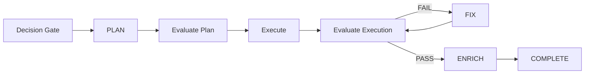

# GearSnitch `/loop` Workflow

This repo uses a decision-aware Evaluate-Loop to finish the remaining iOS, web, and backend work without losing state between sessions.

## Loop Contract

## What `/loop` Means In This Repo

`/loop` is the conversational entrypoint for this workspace.

Use these forms:

- `/loop status` — inspect active tracks and their current step
- `/loop next` — choose the highest-priority unblocked track
- `/loop start <track-id>` — begin a new track at `PLAN`
- `/loop resume <track-id>` — continue from the step recorded in `metadata.json`
- `/loop fix <track-id>` — apply fixes after an evaluation failure

The terminal mirror for those actions is `node scripts/loop.mjs`.

## Decision Gate

Before planning, confirm:

- the requested work belongs to the selected track
- the work does not duplicate a completed track
- the track dependencies are satisfied
- the direction does not conflict with prior decisions in `conductor/decision-log.md`

If a request crosses product, backend, and platform boundaries, prefer updating the track spec before planning.

## Step 1: PLAN

Inputs:

- `conductor/tracks.md`
- `conductor/product.md`
- `conductor/tech-stack.md`
- `conductor/tracks/<track-id>/spec.md`
- existing `plan.md` if resuming

Output:

- a phased `plan.md`
- updated `metadata.json` with `current_step = "EVALUATE_PLAN"`

Rules:

- keep tasks atomic and verifiable
- call out file ownership when tasks can run in parallel
- note dependencies explicitly

## Step 2: Evaluate Plan

Check:

- scope alignment against the track spec
- dependency order
- overlap with other active or completed tracks
- whether the task granularity is small enough to execute safely

If it fails, update the plan and repeat this step.

## Step 3: Execute

During execution:

- update `plan.md` continuously
- mark task state using `[ ]`, `[~]`, `[x]`, `[!]`
- keep changes scoped to the selected track
- run the smallest meaningful validation after each logical slice

## Step 4: Evaluate Execution

Check:

- acceptance criteria in `spec.md`
- build/lint/typecheck/test outcomes for the touched surface
- regressions in auth, state, and API contracts
- UX consistency across iOS, web, and backend response envelopes

If it fails, enter `FIX`.

## Step 5: Fix

Convert evaluation findings into concrete fix tasks inside `plan.md`, execute them, and return to execution evaluation.

Guardrails:

- fix the failing requirement, do not expand scope
- stop and log a blocker after 3 failed fix cycles

## Step 6: Enrich

After a passing execution evaluation:

- update `conductor/knowledge/patterns.md`
- append recurring failure modes to `conductor/knowledge/errors.json`
- record any durable product or architecture decision in `conductor/decision-log.md`

This is the self-improvement layer. The loop is not complete until the learning is written back.

## Track State Rules

Each track persists state in `metadata.json`.

- `current_step` is the source of truth for where to resume
- `step_status` is one of `NOT_STARTED`, `IN_PROGRESS`, `PASSED`, `FAILED`, `BLOCKED`
- `fix_cycle_count` limits infinite churn

## Current Strategy For GearSnitch

The loop should prefer this sequence:

1. `backend_core_services_20260411`
2. `web_auth_dashboard_20260411`
3. `ios_completion_20260411`

That order matches the current dependency reality in `docs/HANDOFF.md`: backend persistence blocks the real web account flow and several iOS surfaces.
